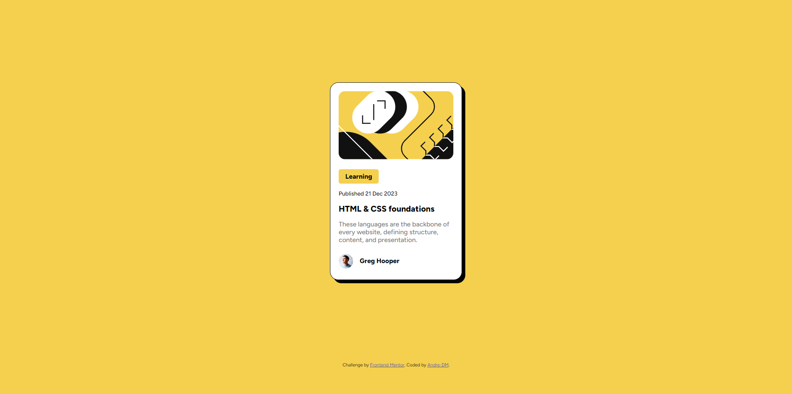

# Frontend Mentor - Blog preview card solution

This is a solution to the [Blog preview card challenge on Frontend Mentor](https://www.frontendmentor.io/challenges/blog-preview-card-ckPaj01IcS). Frontend Mentor challenges help you improve your coding skills by building realistic projects.

## Table of contents

- [Overview](#overview)
  - [The challenge](#the-challenge)
  - [Screenshot](#screenshot)
  - [Links](#links)
- [My process](#my-process)
  - [Built with](#built-with)
  - [What I learned](#what-i-learned)
  - [Continued development](#continued-development)
  - [Useful resources](#useful-resources)
- [Author](#author)
- [Acknowledgments](#acknowledgments)

## Overview

### The challenge

Users should be able to:

- See hover and focus states for all interactive elements on the page

### Screenshot

### Links

- Solution URL: [https://www.frontendmentor.io/solutions/blog-preview-card-flexbox-po2SMRJmQH]
- Live Site URL: [https://andre-dm.github.io/blog-preview-card-main/]

## My process

### Built with

- Semantic HTML5 markup
- CSS custom properties
- Flexbox
- Mobile-first workflow

### What I learned

I didn't know how to import fonts from a local folder, I'm not sure if I did everything correctly, so I'd appreciate some feedback on that!

### Continued development

I would like to continue to work on the arrangement of elements on the web page, such as an image within a single div (I know this does not perfectly reflect the one in the design, I would like to understand what I am missing to be able to do this).

### Useful resources

- [PX to Rem Converter](https://nekocalc.com/px-to-rem-converter) - It helped me a lot to convert px to rem.

## Author

- Frontend Mentor - [@Andre-DM](https://www.frontendmentor.io/profile/Andre-DM)
